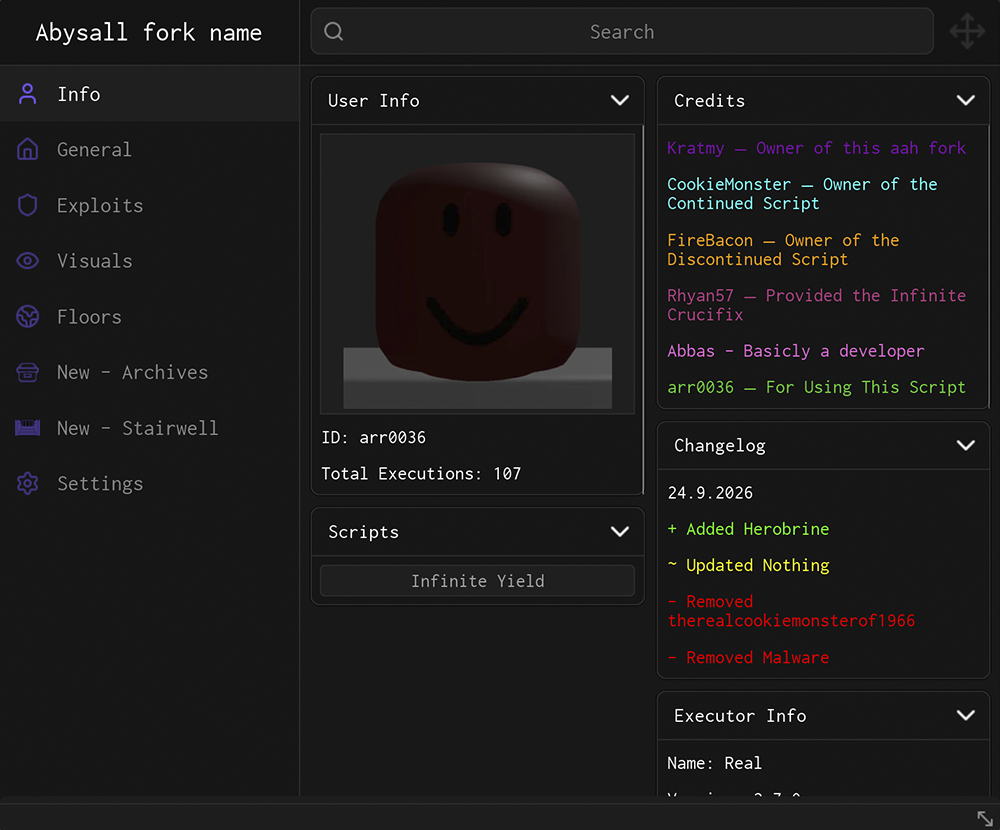
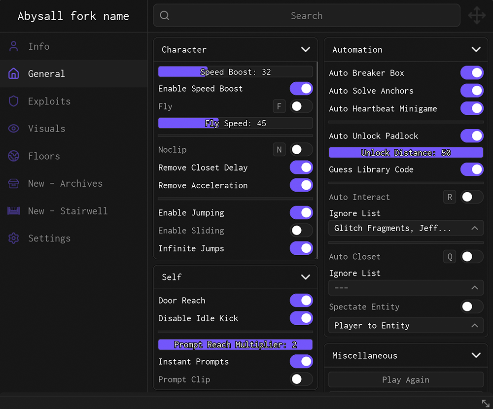
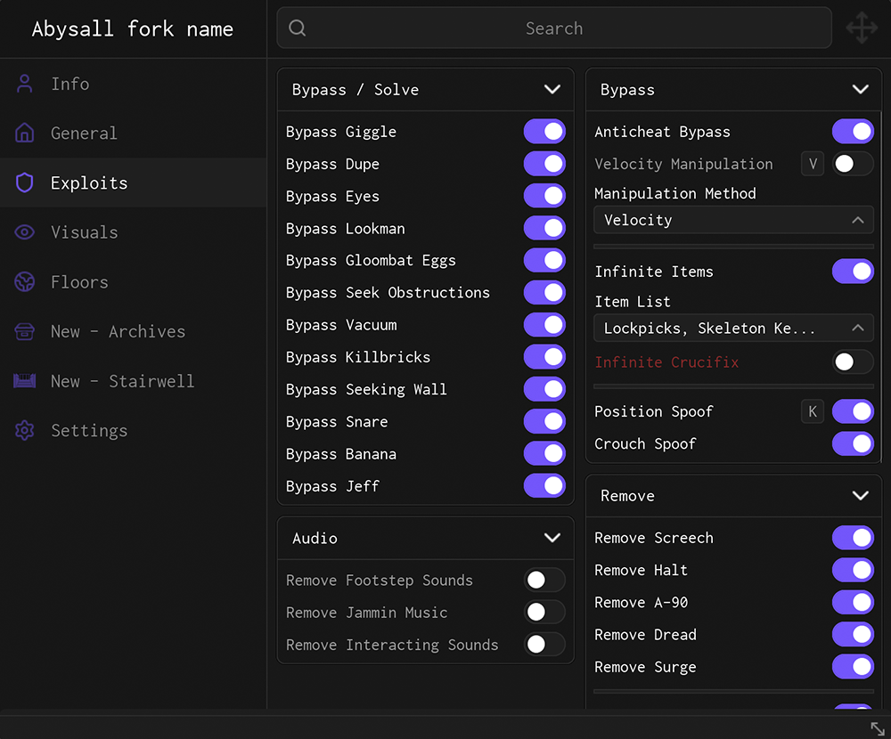

# AbysallF Hub is a free, open-sourced Roblox script hub.
If you want to try it for yourself:
```
loadstring(game:HttpGet("https://raw.githubusercontent.com/kratmy/AbysallF/main/Loader.luau"))()
```
Feel free to use any of the source code for your own projects, but credit would be appreciated.

<br>

<p align="center">
  
  
</p>
<p align="center">
  
</p>
